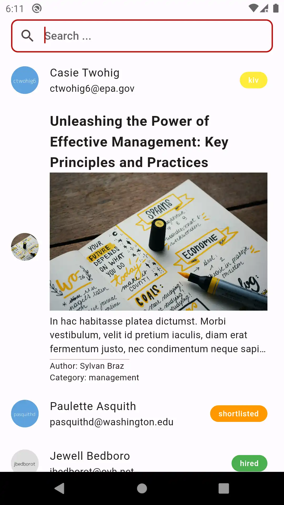

# Modularized Job Search App with Flutter

## Overview

This Flutter project aims to develop a modularized job search application, leveraging various technologies to ensure scalability, maintainability, and flexibility in development.

## Features

- **Modular Architecture**: The project follows a modular architecture approach, separating features into independent modules for better code organization and maintainability.

- **Job Search**: Users can search for job listings based on various criteria such as location, job title, and keywords.

## Technologies Used

- **Flutter**: The project is developed using Flutter, a cross-platform UI toolkit for building natively compiled applications for mobile, web, and desktop from a single codebase.

- **Dio**: Dio is used for making HTTP requests to fetch job listings from external APIs.

- **Modular**: The Modular package is employed to implement a modular architecture, enabling easy separation of features into independent modules.

- **Bloc**: Flutter bloc is one of the state management for Flutter applications. You can use it to handle all the possible states of your application, powerful solution for managing application flow and state.

## Todo
- Extensions function
- Unit Test
- Localizations using flutter get10n